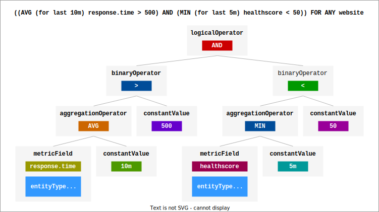

# Crafting Alert Definition Conditions

Defining alert conditions can be likened to constructing a tree. With specific node types at your disposal, this format provides immense flexibility, allowing you to create intricate nested structures using logical operators. For clarity, let's visualize this using an example:

Suppose you want to be alerted if any website entity has:
- An average response time over the last 10 minutes exceeding 500 ms, and
- A minimum health score over the last 5 minutes below 50.

This can be represented as:



```
{
  type: "logicalOperator",
  operator: "AND",
  operands: [
    ...
  ]
}
```

## Understanding Node Types

Nodes essentially fall into two categories:

1. **Operator Nodes:** These are the building blocks that help define the structure of your condition.
2. **Value Nodes:** These connect to specific data sources, with the exception of the `constantValue` node.

### Operator Nodes:

- **`logicalOperator`**: Combines multiple condition nodes.
  - `operator`: (Mandatory. Allowed values: `AND`, `OR`)
- **`unaryOperator`**: Applies a unary operation to the subsequent node.
  - `operator`: (Mandatory. Allowed values: `!`)
- **`binaryOperator`**: Compares two subsequent node outputs.
  - `operator`: (Mandatory. Allowed values: `>`, `<`, `>=`, `<=`, `=`, `!=`, `IN`)
- **`aggregationOperator`**: Specifies the aggregation for the operand.
  - `operator`: (Mandatory. Allowed values: `AVG`, `MIN`, `MAX`, `LAST`, `COUNT`, `SUM`. Default: `LAST`)

### Value Nodes:

- **`constantValue`**: Represents a value.
  - `dataType`: (Mandatory. Allowed values: `string`, `number`, `boolean`)
  - `value`: (Needed unless operator is `IN`. The value should match the specified type.)
  - `values`: (Needed if operator is `IN`. Non-null values that match the type.)
- **`attributeField`**: Used for conditions based on entity attribute data.
  - `fieldName`: (Mandatory. Use the exact entity service attribute name. For nested attributes, apply dot notation, like `state.nativeState`)
  - `entityFilter`: (Optional. More details below)
- **`metricField`**: Pertains to conditions reliant on metric data.
  - `fieldName`: (Mandatory. Use the precise metric name.)
  - `metricFilter`: (Optional. More details below)
  - `entityFilter`: (Optional. More details below)
- **`queryField`**: For conditions reliant on logs/events search. The result is the number of records found.
  - `query`: (Mandatory. Logs/events query.)
  - `source`: (Mandatory. Namespace. Default: `logs`)
  - `entityFilter`: (Optional. More details below)

### Diving Deeper into Filters:

#### **`metricFilter`**:

Select measurements based on specific tags. You can exclude tags using the exclusion filter. For more specifics, refer to the [GraphQL schema](../graphql/schema.graphql) and look for `AlertFilterExpressionInput`.

#### **`entityFilter`**:

This filter is handy if you want to restrict the condition to a particular set of entities. Leaving it out means the system evaluates metrics/logs across the board. When provided but left empty, all entities are considered, without any further filtration.

You can apply this filter in two ways:
1. **Simple Mode**: Filter by `types` (array of entity types) or `ids` (array of entity IDs), or use both.
2. **Advanced Mode**: Check the `fields` property of `AlertConditionNodeEntityFilterInput` in the relevant [GraphQL schema](../graphql/schema.graphql).
